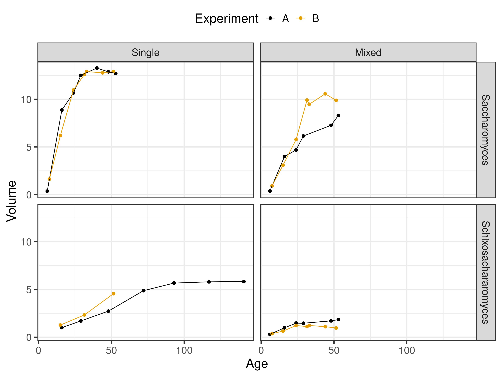
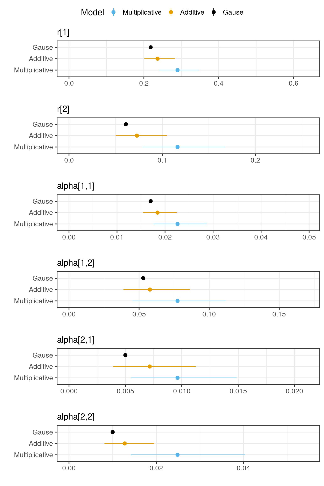

# Lotka-Volterra competition model in Stan

## Data

The data is available in two csv files in the `Data` folder (one for each set of experiment) and was published in [Gause (1932)](http://jeb.biologists.org/content/jexbio/9/4/389.full.pdf) to study the competition of two species of yeast: saccharomyces and schixosacharomyces.

The data was collected in 3 differents experimental settings, each of them repeated twice (experiment A and B):
- Saccharomyces alone (single species setting)
- Schixosacharomyces alone (single species setting)
- Saccharomyces and Schixosacharomyces together (mixed species setting)

## Model

The evolution of the population of yeasts is modelled with the competitive Lokta-Volterra equations.
For a single species $$p$$:

**Work in progress**

Two models are proposed, one with multiplicative error, the other with additive error.
The two models notably implement a Cauchy regularisation on the alpha matrix (matrix of competition rates). The regularisation could be changed to a Gaussian distribution (cf. ridge regularisation), Laplace (cf. lasso regularisation) or to the Horseshoe distribution.

## Results

